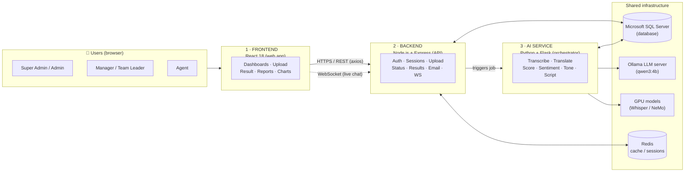
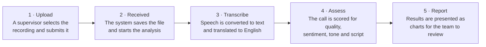
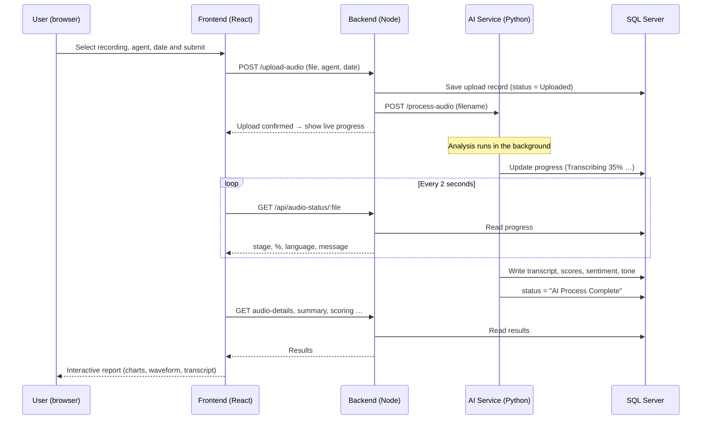
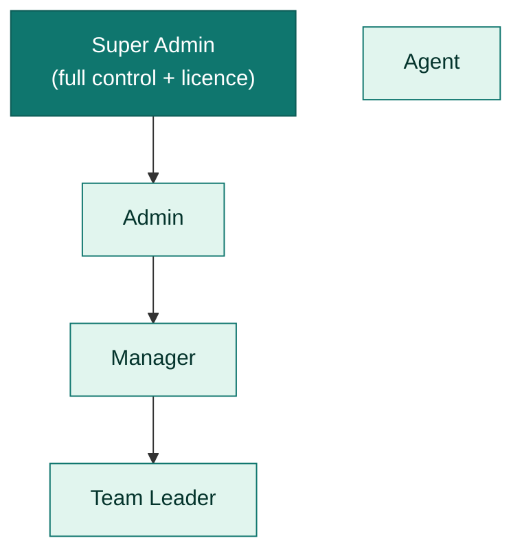
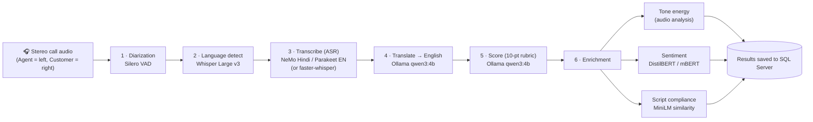
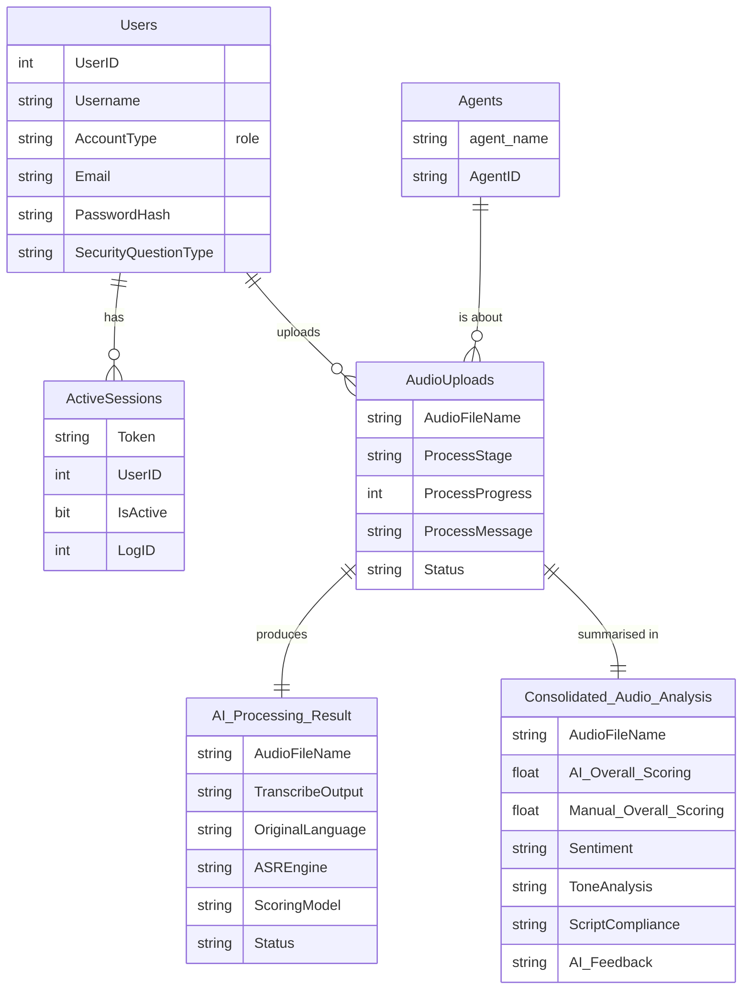
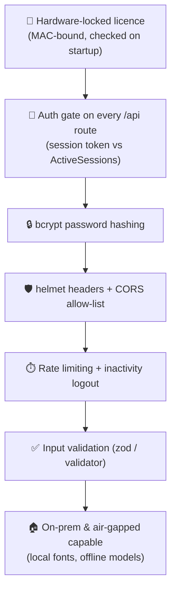

# AI-Powered Call Analysis — Project Documentation

> A complete reference describing how this system is designed and how it operates, written for both technical and non-technical readers.
> Audience: developers, reviewers, operations teams, and business stakeholders.
>
> Diagrams render automatically when the file is opened in a Markdown viewer that supports Mermaid (for example, VS Code or a Git host).

---

## 1. Overview

This is an **AI-powered call quality-analysis platform** for contact centres / banking voice processes. A supervisor uploads a recorded call; the system automatically **transcribes** it (Hindi or English), **translates** it to English, **scores** the agent against a 10-point quality rubric, analyses **sentiment** and **voice tone**, and checks how well the agent followed the **required script**. Results are shown as an interactive dashboard with charts, a playable waveform, and a side-by-side conversation transcript. Managers and team leaders review scores, add their own manual scores, and track performance over time. Agents get their own dashboard with knowledge tests and live chat with supervisors.

It is designed to run **on-premise** (the customer's own servers), can run **air-gapped** (no internet), and is protected by a **hardware-locked licence**.

---

## 2. System Architecture

The platform comprises **four independent components** that communicate with one another. Each can be deployed and scaled independently.



**How the components interact:** the web browser communicates only with the **Backend**. The Backend stores all information in the **database** and, when a call is uploaded, instructs the **AI Service** to begin processing. The AI Service performs the speech and language analysis (using GPU-accelerated models and a local language model) and writes its results back into the same database. The Frontend then retrieves those results from the Backend and presents them as charts.

---

## 3. Technology Stack

| Layer | Built with | Language | Why |
|---|---|---|---|
| **Frontend** | React 18 (Create React App), React Router 7 | JavaScript / JSX | The web interface every user sees |
| **Backend** | Node.js + Express, WebSocket (`ws`) | JavaScript | REST API, security, business logic, live chat |
| **AI Service** | Python 3 + Flask | Python | Runs the machine-learning pipeline |
| **Database** | Microsoft SQL Server (MSSQL) | SQL | Single source of truth for all data |
| **LLM** | Ollama running `qwen3:4b` | — | Call scoring & translation |
| **Speech models** | Whisper Large v3, NVIDIA NeMo, faster-whisper | — | Speech-to-text + language detect |
| **Cache / sessions** | Redis | — | Fast session + data caching |
| **Packaging** | Docker / Docker Compose | — | Repeatable deployment (incl. GPU) |

---

## 4. How a Call Is Processed

After a recording is submitted, the system completes the analysis automatically in five stages. No further manual steps are required.



**Step by step:**

1. **Upload** — a supervisor chooses a call recording, selects the agent and the call date, and submits it.
2. **Received** — the system saves the recording and starts the analysis. A live progress indicator keeps the supervisor informed throughout.
3. **Transcribe** — the conversation is converted into written text, the agent and customer are separated, and the text is translated into English where required.
4. **Assess** — the call is evaluated against a 10-point quality checklist, and the sentiment, voice tone, and adherence to the required script are analysed.
5. **Report** — the completed results are presented as an interactive report (scores, charts, a playable recording, and the full transcript) for managers and team leaders to review.

The same process, shown in technical request-by-request detail for developers:



---

## 5. Frontend — Web Application

### 5.1 Architecture & language
- **Language:** JavaScript (JSX). Built with **React 18** via **Create React App** (`react-scripts`).
- **Routing:** `react-router-dom` (single-page app — pages switch instantly without reloading).
- **Design system:** a **token-driven CSS theme** (one set of CSS variables for colour, spacing, fonts) plus a small library of reusable UI building-blocks (`Button`, `Card`, `StatCard`, `ChartPanel`, `Modal`, etc.). Changing the theme in one place restyles the entire application. The current theme uses warm-cream surfaces, teal-green accents, and serif headings (the "Sri Kuber" visual identity). Fonts are **self-hosted** (DM Sans + Source Serif 4), allowing the application to run **offline / air-gapped**.
- **Shell:** a shared application shell — a collapsible **sidebar** plus a **top bar** (breadcrumbs, theme toggle, profile menu) — wraps every authenticated page. The application **name and logo are configurable** (white-label branding), applied at runtime.

### 5.2 How the frontend gets data from the backend
- All data is fetched over **HTTPS REST** using **`axios`**. A central API client automatically attaches the user's session **token** to every request (so the user never has to re-authenticate per call).
- **Live updates** (processing progress, agent–supervisor chat) use a **WebSocket** connection for instant push, plus light polling where needed.
- Tabular data can be **exported** to **Excel** (`exceljs`) and **PDF** (`jspdf`).

### 5.3 How information is shown graphically
| Visual | Library | Used for |
|---|---|---|
| Line / bar / doughnut / radar charts | Chart.js + react-chartjs-2 | Tone energy, sentiment split, scoring rubric, trends |
| Gauge | react-gauge-chart | Script compliance % |
| Audio waveform (play / seek) | wavesurfer.js | Listening to the call on the result page |
| Progress rings & animated bars | custom SVG/CSS | Upload & processing console |
| Toasts / modals | react-toastify | Feedback and dialogs |

### 5.4 Security on the frontend
- **Login CAPTCHA** (`react-simple-captcha`) to deter automated logins.
- Session **token** kept in the browser and sent as a header; a global handler **logs the user out automatically on a 401** (expired/invalid session).
- **Inactivity auto-logout** (≈110 minutes) on sensitive pages.
- **Input validation** with `zod` / `validator` before sending to the server.
- **Error boundary** + **Sentry** for crash capture, so a single broken widget can't take down the page.
- Profile images and other gated assets are fetched **through the authenticated API**, never as a plain public URL.

### 5.5 Pages / "tabs" and who can see them

There are two experiences depending on the logged-in role.

**A) Staff experience** (Super Admin, Admin, Manager, Team Leader) — sidebar navigation:

| Tab / Page | Purpose |
|---|---|
| **Dashboard** | KPIs, charts, recent activity overview |
| **Audio Upload** | Upload a call → live AI processing console |
| **Reports** | Detailed report dashboard, filters, export |
| **Result page** (`/results/:file`) | Per-call deep dive: transcript, summary, tone, sentiment, scoring rubric (AI vs manual), script compliance, waveform |
| **Agents** | List / manage agents, **Add Agent** |
| **Users** | User management, **Create User** |
| **Team Leader** | Team-leader workspace + recent activity |
| **Monitoring** | Live system / server health |
| **Settings** | Profile, email, password, security question, photo |
| **License Management** | Upload / manage the product licence (Super Admin) |
| **About / Help** | Documentation & guidance |

**B) Agent experience** — a focused dashboard only:

| Page | Purpose |
|---|---|
| **Agent Dashboard** | Daily briefing, knowledge tests, live chat with supervisor |
| **Agent Settings** | Profile, password, security question, photo |

---

## 6. User Roles & Access

Five roles. Access is enforced **both** in the UI (hiding tabs) **and** on the server (the API rejects unauthorised calls).



| Capability | Super Admin | Admin | Manager | Team Leader | Agent |
|---|:---:|:---:|:---:|:---:|:---:|
| Dashboard & Reports | ✅ | ✅ | ✅ | ✅ | — |
| Upload & analyse calls | ✅ | ✅ | ✅ | ✅ | — |
| View result page / scoring | ✅ | ✅ | ✅ | ✅ | — |
| Manage **Agents** | ✅ | ✅ | ✅ | — | — |
| Manage **Users** | ✅ | ✅ | ✅ | — | — |
| **Team Leader** workspace | ✅ | — | — | ✅ | — |
| **System Monitoring** | ✅ | ✅ | — | — | — |
| **License Management** | ✅ | — | — | — | — |
| Agent dashboard / tests / chat | — | — | — | — | ✅ |

*(Derived from the app's navigation gating and route guards.)*

---

## 7. Backend — Application Server

### 7.1 Architecture & language
- **Language:** JavaScript on **Node.js**, using the **Express** web framework. A single API server exposes REST endpoints under `/api/...` plus a **WebSocket** server for live features.
- **Responsibilities:** authentication & sessions, file uploads, triggering AI jobs, serving processed results, **automatic folder-based ingestion** (auto-upload watcher), **call-audit** records, role-based admin settings, scheduled background jobs, email, system monitoring, and profile-image processing.

### 7.2 Key building blocks
| Concern | Library | Notes |
|---|---|---|
| Web framework | `express` | REST API |
| Database | `mssql`, `msnodesqlv8` | SQL Server access + stored procedures |
| Auth | `bcrypt`/`bcryptjs`, `jsonwebtoken`, `express-session` | Hashed passwords, session tokens |
| Sessions/cache | `redis`, `connect-redis`, `node-cache` | Fast session & data caching |
| Live chat | `ws` | Agent ↔ supervisor messaging, broadcasts |
| Uploads | `multer` | Audio + profile-picture uploads |
| Email | `nodemailer` | Forgot-password & notifications |
| Scheduled jobs | `node-cron` | Auto-upload watcher, stale-job cleanup |
| Images | `sharp` | Resize/normalise profile photos |
| Monitoring | `systeminformation` | CPU/RAM/disk for the Monitoring page |
| Logging | `winston` | Structured server logs |

### 7.3 Security (defence in depth)
- **`helmet`** — secure HTTP headers.
- **`cors`** — only the trusted frontend origin may call the API.
- **`express-rate-limit`** — throttles abusive/brute-force traffic (e.g., uploads, login).
- **Central auth gate** — *every* `/api/*` route requires a valid **session token** (checked against the `ActiveSessions` table). A short allow-list (login, licence check, password reset) is public. This is why protected resources can't be opened with a plain link.
- **`bcrypt`** password hashing; **`express-validator` / `validator`** input sanitisation.
- **Hardware-locked licence** — the server validates a MAC-address-bound licence key on startup and on demand; an invalid/expired licence blocks the app (with a Super-Admin recovery path).

### 7.4 How the backend talks to the AI service
When a file is uploaded, the backend saves it, records it in the database, then calls the AI service's **`POST /process-audio`** (secured with a shared secret header). The AI service runs asynchronously and writes progress + results straight to the database; the backend simply reads them back for the frontend.

---

## 8. AI Engine

### 8.1 Architecture & language
- **Language:** Python 3, served by **Flask** (`orchestrator.py`, port **8000**).
- **Design:** a small **orchestrator** that runs a chain of focused **workers** (one per task). Each worker loads its own model and writes results to the database. GPU memory is released between heavy stages.
- **Service API:** `GET /health`, `POST /process-audio`, `POST /upload-and-process`.

### 8.2 The processing pipeline



### 8.3 Which model does what

| Stage | Model / tech | Runs on | What it produces |
|---|---|---|---|
| **Speaker split (diarization)** | Silero VAD | CPU/GPU | Separates Agent vs Customer (uses stereo channels) |
| **Language detection** | **Whisper Large v3** (detect-only) | GPU preferred | Hindi vs English |
| **Transcription — Hindi** | **NVIDIA NeMo** `stt_hi_conformer_ctc_medium` | **GPU** | Hindi speech → text |
| **Transcription — English** | **NVIDIA NeMo** `parakeet-rnnt-1.1b` | **GPU** | English speech → text |
| **Transcription — fallback** | **faster-whisper** (Whisper Large v3 / CTranslate2) | GPU/CPU | Used on laptops or when NeMo isn't available |
| **Translation** | **Ollama `qwen3:4b`** (local LLM) | GPU/CPU | Non-English transcript → English |
| **Call scoring** | **Ollama `qwen3:4b`** | GPU/CPU | 10-point rubric, lead type, resolution, feedback, summary |
| **Sentiment (English)** | `distilbert-base-uncased-finetuned-sst-2-english` | GPU/CPU | Positive / neutral / negative per line |
| **Sentiment (multilingual)** | `nlptown/bert-base-multilingual-uncased-sentiment` | GPU/CPU | Sentiment for non-English |
| **Script compliance** | `sentence-transformers/all-MiniLM-L6-v2` | GPU/CPU | Similarity of agent speech to the required banking script |
| **Tone analysis** | Audio energy analysis (librosa/torchaudio) | CPU/GPU | High/medium/low tone bands over time |

### 8.4 GPU Server & Accuracy
- **Production target:** an **NVIDIA A5000 GPU**, run via Docker (`docker-compose.gpu.yml`, base image `nvcr.io/nvidia/nemo`). The NeMo ASR models and transformer models load onto the GPU; the Ollama LLM also benefits from the GPU.
- **Offline-friendly:** model files live on disk under `models/`; `HF_HUB_OFFLINE=1` is set so **no internet download** is needed at run time.
- **Accuracy considerations:** the system is designed around **stereo** recordings (the agent on one channel, the customer on the other), which is what makes reliable speaker separation and per-speaker scoring possible. Mono recordings are still supported but produce a single combined transcript with lower fidelity. In practice, accuracy depends primarily on **audio quality, correct stereo channels, and language match**. NeMo (on GPU) is the production-grade transcription path; faster-whisper is the lightweight path used for laptops and development.

---

## 9. Database

- **Engine:** **Microsoft SQL Server**. Both the Node backend (`mssql`) and the Python AI service (`pyodbc`) read and write the same database, which is how the two services stay in sync without talking to each other directly.

### 9.1 Core tables



| Table | What it holds |
|---|---|
| **Users** | Accounts, role (`AccountType`), email, hashed password, security question |
| **ActiveSessions** | Live login sessions (token-based) — the auth gate checks this on every request |
| **AudioUploads** | One row per uploaded call + live processing progress (`ProcessStage`, `ProcessProgress`, `ProcessMessage`, `Status`) |
| **AI_Processing_Result** | Raw AI output: transcript, detected language, which ASR/scoring/translation model was used |
| **Consolidated_Audio_Analysis** | The "master" results row: every AI score + manual score, sentiment, tone, script compliance, feedback, summary, agent metadata |
| **Agents** | Agent directory (name, ID, supervisor, etc.) |

Stored procedures (e.g., `dbo.FetchCallsProcessed7Days`) power the dashboard analytics.

---

## 10. Security Overview



---

## 11. Deployment & Operations

- **Containerised** with Docker Compose. Several compose files target different setups: laptop/dev, faster-whisper, NeMo CPU, and **GPU** (`docker-compose.gpu.yml`).
- **Typical ports:** Frontend `3000`, Backend `5000`, AI Service `8000`, Ollama `11434`, SQL Server `1433`.
- **On-premise & air-gapped:** all fonts, scripts, and ML models are kept local — the app can run with **no internet access**.
- **Licensing:** a MAC-address-locked licence governs whether the application will run; a Super-Admin recovery flow allows uploading a new licence.

---

## 12. Project Structure

The repository is organised by component. The most relevant folders are shown below; build outputs, dependency folders (`node_modules`, virtual environments), and logs are omitted.

### Repository root

```text
AI-Powered Call Analysis project/
├─ frontend/             React web application (the user interface)
├─ backend/              Node.js + Express API server
├─ ai-mvp/               Python AI pipeline (Flask orchestrator + workers)
├─ models/               Local ML model files (Whisper, NeMo) — kept offline
├─ data/                 Audio uploads and AI working directories
├─ Database/             Database scripts and backups
├─ scripts/              Start-up / operations scripts (e.g. NeMo launchers)
├─ license/              Active licence file
├─ license-generator/    Tooling to issue MAC-locked licences
├─ AutoUpload/           Watched folder for automatic call ingestion
├─ logs/                 Runtime logs
├─ docker-compose*.yml   Deployment variants (dev, GPU, NeMo, faster-whisper)
└─ PROJECT_DOCUMENTATION.md / .pdf    This document
```

### Frontend — `frontend/src/`

```text
src/
├─ components/
│  ├─ ui/         Reusable design-system primitives (Button, Card, StatCard, ChartPanel …)
│  ├─ layout/     Application shell — Sidebar, AppTopBar, AuthenticatedLayout, auth & hero panels
│  ├─ reports/    Report-dashboard pieces (KPI strips, donut & chart cards)
│  ├─ admin/      Admin panels (auto-upload, licence)
│  ├─ shared/     Shared widgets (KpiCard, RecentActivityPanel)
│  ├─ chat/       Agent ↔ supervisor chat
│  └─ *.jsx       Page components (Dashboard, UploadPage, ResultPage, Settings …)
├─ context/       React contexts (Chat, WebSocket, Sidebar state)
├─ hooks/         Reusable hooks (e.g. useLocations)
├─ theme/         Theme provider, design tokens, chart theme, animations
└─ utils/         API client, authentication, branding, audio probing, export, config
```

### Backend — `backend/`

```text
backend/
├─ server.js                  Main Express app — all REST + WebSocket endpoints
├─ middleware/auth.js         Central authentication gate (session-token check)
├─ routes/                    Feature routers (call audits, auto-upload)
├─ services/                  Background services (auto-upload watcher)
├─ migrations/                SQL migrations (RBAC settings, auto-upload, call audits)
├─ db.js · sqlClient.js · dbConnection.js   SQL Server connectivity
├─ agentController.js · agentHelper.js       Agent management
├─ authHelper.js                             Login, sessions, password handling
├─ uploadHandler.js · pythonScriptHandler.js  File upload + AI-job triggering
├─ licenseConfig.js · generate-local-license.js   Licensing
├─ logger.js                                 Structured logging (winston)
└─ seed-*.js                                 Seed scripts (super admin, test users)
```

### AI Engine — `ai-mvp/`

```text
ai-mvp/
├─ orchestrator.py            Flask service — receives jobs and runs the pipeline
├─ transcribe.py              ASR entry point (selects NeMo / faster-whisper / Whisper)
├─ diarization_worker.py      Speaker separation (Silero VAD)
├─ language_worker.py         Language detection (Whisper Large v3)
├─ nemo_worker.py · faster_whisper_worker.py · whisper_asr_worker.py   Transcription backends
├─ translation_worker.py      Translate to English (Ollama)
├─ scoring_worker.py          Call scoring (Ollama qwen3:4b)
├─ enrichment_worker.py       Coordinates tone + sentiment + script analysis
├─ tone_worker.py · sentiment_worker.py · script_worker.py   Enrichment models
├─ db.py · db_schema.py       SQL Server read/write + table definitions
├─ config.py                  Model paths, feature toggles, device selection
└─ Dockerfile* · requirements*.txt   Packaging (CPU / GPU / NeMo)
```

> **Recent additions reflected in the code:** a collapsible **sidebar + top-bar** application shell, **configurable white-label branding** (application name & logo), **automatic folder-based call ingestion** (auto-upload), and **call-audit** records with role-based admin settings.

---

## 13. Glossary

| Term | Meaning |
|---|---|
| **ASR** | Automatic Speech Recognition — turning speech into text |
| **Diarization** | Working out *who* spoke *when* (Agent vs Customer) |
| **LLM** | Large Language Model — the AI that reads the transcript and scores the call |
| **Sentiment** | Whether speech sounds positive, neutral, or negative |
| **Tone analysis** | How loud/energetic the voice is over time |
| **Script compliance** | How closely the agent followed the required wording |
| **Rubric** | The 10-point checklist used to score a call |
| **Air-gapped** | A server with no internet connection (for security) |
| **On-prem** | Software running on the customer's own servers, not the cloud |

---

*Generated from a direct review of the codebase (frontend, backend, ai-mvp, database schema). If a model version, port, or role rule changes in code, update the matching section here.*
