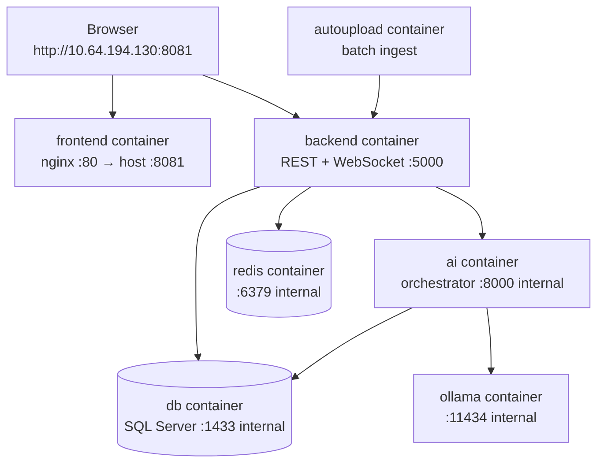

# Docker production deployment — master plan

**Target server:** Linux `10.64.194.130` (no domain, **no internet**)  
**Build machine:** Windows (this PC) via **WSL2 + Docker Desktop**  
**Database:** Containerized SQL Server with baked `Database/backup.bak`  
**AutoUpload:** Included in v1 (`ai-call-autoupload:prod` container)

This project **already includes** a production bundle under `production/` with Dockerfiles, compose file, and scripts. This plan uses that bundle and tailors it for your environment.

---

## 0. Architecture overview



| Container | Image tag | Host port | Persistent data |
|-----------|-----------|-----------|-----------------|
| frontend | `ai-powered-call-analysis-frontend:prod` | **8081** | none (static build) |
| backend | `ai-call-backend:prod` | **5000** | `volumes/*` mounts |
| db | `call-analysis-db:prod` | internal | Docker volume `dbdata` |
| redis | `redis:7-alpine` | internal | Docker volume `redisdata` |
| ai | `ai-call-orchestrator:prod` | internal | `volumes/models`, `work`, `audio` |
| ollama | `ollama/ollama:latest` | internal | `volumes/ollama` |
| **autoupload** | `ai-call-autoupload:prod` | internal | `volumes/autoupload/{metadata,audio,logs}` |

**User access URL:** `http://10.64.194.130:8081`  
**API + WebSocket:** `http://10.64.194.130:5000` (browser calls this directly — port 5000 must be open on the firewall)

---

## 1. Decisions to make before building (Phase 0)

Answer these **once** before running any scripts.

| Decision | Your choice (confirmed) |
|----------|-------------------------|
| **Build machine** | **Windows PC** — use WSL2 (`production/scripts/BUILD-ON-WINDOWS.md`) |
| **Database** | **Containerized** `call-analysis-db:prod` with current data from `Database/backup.bak` |
| **GPU** | **Yes** — NVIDIA + nvidia-container-toolkit on prod |
| **PUBLIC_HOST** | **`10.64.194.130`** |
| **CORS_ORIGIN** | **`http://10.64.194.130:8081`** |
| **AutoUpload** | **Yes — v1** (`autoupload` service in compose) |
| **Offline prod** | **Yes** — load from `.tar` files only |

### Disk & transfer budget

| Item | Approx size |
|------|-------------|
| 6 Docker images (`.tar`) | 25–35 GB |
| `models-bundle.tgz` | 5–15 GB (depends on models) |
| `ollama-models.tgz` | 2–8 GB |
| **Total transfer** | **~35–50 GB** |

---

## 2. Production folder layout on the server

Everything lives under one root — **do not scatter paths**.

```
/opt/call-analysis/production/
├── docker-compose.prod.yml      # stack definition
├── .env                         # secrets + PUBLIC_HOST (never commit)
├── README.md
├── scripts/
│   ├── 00-build-and-save-images.sh   # BUILD machine only
│   ├── 00b-package-ai-assets.sh      # BUILD machine only
│   ├── 01-create-folders.sh          # PROD — once
│   ├── 02-load-images.sh             # PROD — once per image update
│   ├── 03-up.sh                      # PROD — start stack
│   └── backup-db.sh                  # PROD — optional
├── images/                      # offline image archives (7 files)
│   ├── 01-db.tar … 06-ollama.tar
│   └── 07-autoupload.tar
├── models-bundle.tgz            # extract → volumes/models
├── ollama-models.tgz            # extract → volumes/ollama
├── license/
│   └── license.lic              # MAC-locked license file
└── volumes/                     # persistent host data
    ├── audio/                   # uploaded call recordings
    ├── chat/                    # chat dumps
    ├── logs/                    # backend logs
    ├── logs/ai/                 # AI orchestrator logs
    ├── profile_pictures/
    ├── models/                  # Whisper, NeMo, etc.
    ├── ollama/                  # LLM model cache
    ├── work/                    # AI temp files
    └── autoupload/              # batch ingest (drop CSV + audio here)
        ├── metadata/
        ├── audio/
        └── logs/
```

Docker named volumes (managed by compose, not in `volumes/` folder):

- `dbdata` — SQL Server data files
- `redisdata` — Redis persistence

---

## 3. Phase 1 — Build on Windows (WSL2)

See **`production/scripts/BUILD-ON-WINDOWS.md`**.

```bash
cd "/mnt/c/Project/AI-Powered Call Analysis project/production"
cp .env.example .env && nano .env
bash scripts/00-build-and-save-images.sh    # 7 images including autoupload
bash scripts/00b-package-ai-assets.sh
```

---

## 4. Phase 2 — Transfer to prod server

Copy the **entire** `production/` folder to the server:

```bash
rsync -av --progress production/ user@10.64.194.130:/opt/call-analysis/production/
```

Include:

- `images/` (all `.tar` or `.tar.gz`)
- `models-bundle.tgz`, `ollama-models.tgz`
- `docker-compose.prod.yml`, `scripts/`, `.env.example`
- Your `license/license.lic`

**Do not** copy dev `node_modules`, `code backup/`, or local `.env` with dev secrets unless reviewed.

---

## 5. Phase 3 — Prod server prerequisites

On **`10.64.194.130`**:

### Step 3.1 — Install Docker

```bash
sudo apt update
sudo apt install -y docker.io docker-compose-v2
sudo usermod -aG docker $USER
# log out and back in
```

### Step 3.2 — GPU (if using AI + Ollama)

```bash
nvidia-smi                    # driver OK?
docker info | grep -i nvidia  # container toolkit OK?
```

If no GPU: edit `docker-compose.prod.yml` — remove `deploy:` GPU blocks on `ai` and `ollama`, set `NEMO_DEVICE=cpu` (slow but works).

### Step 3.3 — Firewall

```bash
sudo ufw allow OpenSSH
sudo ufw allow 8081/tcp    # web app
sudo ufw allow 5000/tcp    # API + WebSocket (browser direct)
sudo ufw enable
```

Ports **1433, 6379, 8000, 11434** stay **internal** (not published).

---

## 6. Phase 4 — Deploy on prod (load + start)

```bash
cd /opt/call-analysis/production
sed -i 's/\r$//' scripts/*.sh    # if bundle came from Windows
chmod +x scripts/*.sh

# 4.1 Folders + .env
./scripts/01-create-folders.sh
nano .env   # confirm PUBLIC_HOST=10.64.194.130, secrets, HOST_MAC

# 4.2 License
cp /path/to/your/license.lic license/license.lic

# 4.3 Models (large — takes time)
tar xzf models-bundle.tgz -C volumes/models
tar xzf ollama-models.tgz -C volumes/ollama

# 4.4 Load Docker images (offline)
./scripts/02-load-images.sh

# 4.5 Start stack
./scripts/03-up.sh
```

First boot: DB restores from baked backup (1–3 min). Wait until `db` is **healthy**.

---

## 7. Phase 5 — Verification checklist

| # | Check | Command / action |
|---|-------|------------------|
| 1 | All containers running | `docker compose -f docker-compose.prod.yml ps` |
| 2 | DB healthy | `docker compose logs db \| tail -20` |
| 3 | Backend up | `curl -s http://10.64.194.130:5000/api/license-status` |
| 4 | Frontend loads | Open `http://10.64.194.130:8081` |
| 5 | Login works | Use **changed** password (not seed defaults) |
| 6 | WebSocket | DevTools → WS → `ws://10.64.194.130:5000` connected |
| 7 | Upload + AI | Upload test audio; check AI logs |
| 8 | License | Admin → License panel shows valid status |

---

## 8. Production-ready improvements (Phase 6 — after first success)

These are **not blockers** for internal pilot but needed for “perfect” production:

| Item | Current state | Target |
|------|---------------|--------|
| **Single entry port** | Browser hits `:8081` + `:5000` | Add nginx reverse proxy → only `:80` public |
| **HTTPS** | HTTP only | When domain exists: certbot + rebuild frontend |
| **Build script cleanup** | Still sets unused `REACT_APP_LICENSE_SECRET_KEY` | Remove (P0 moved license server-side) |
| **AutoUpload** | Not in compose | Add optional `autoupload` service or host cron |
| **External SQL** | Optional | Compose override if DB is not containerized |
| **Healthchecks** | DB has healthcheck | Add backend `/api/license-status` healthcheck |
| **Backups** | `backup-db.sh` exists | Schedule cron + copy `volumes/audio` |
| **Secrets rotation** | Manual | Document rotate + restart procedure |
| **Monitoring** | None | Add container restart policies (already `unless-stopped`) + log rotation |

### Optional: single-port nginx in front of compose

Future enhancement — add an `nginx` service to compose:

- `:80` → frontend static
- `/api/`, `/audio/`, `/ws` → backend
- Rebuild frontend with `REACT_APP_API_BASE_URL=http://10.64.194.130` (no `:5000`)
- Close firewall port 5000

---

## 9. Execution timeline (recommended order)

| Step | Phase | Where | Duration |
|------|-------|-------|----------|
| 1 | Decisions (Section 1) | Meeting / doc | 30 min |
| 2 | Configure `production/.env` | Build machine | 15 min |
| 3 | `00-build-and-save-images.sh` | Build machine | 1–3 hours |
| 4 | `00b-package-ai-assets.sh` | Build machine | 30 min – 2 hours |
| 5 | Transfer bundle | Build → `10.64.194.130` | 1–4 hours (network) |
| 6 | Prod prereqs (Docker, GPU, firewall) | Prod server | 1 hour |
| 7 | `01` → `02` → `03` scripts | Prod server | 30 min + DB restore |
| 8 | Verification (Section 7) | Browser | 30 min |
| 9 | Hardening (Section 8) | Prod server | 1–2 days |

---

## 10. Implemented for v1

- [x] AutoUpload container in `docker-compose.prod.yml`
- [x] `AutoUpload/Dockerfile` + image `07-autoupload.tar`
- [x] Volume folders `volumes/autoupload/{metadata,audio,logs}`
- [x] Windows build guide `production/scripts/BUILD-ON-WINDOWS.md`
- [x] Removed obsolete `REACT_APP_LICENSE_SECRET_KEY` from frontend build

## 11. Optional next (Phase 6)

1. Single-port nginx in front of compose
2. CPU-only compose override
3. Backend healthcheck for autoupload `depends_on`

| Path | Purpose |
|------|---------|
| `production/docker-compose.prod.yml` | Main stack |
| `production/scripts/*.sh` | Build / load / start automation |
| `production/README.md` | Existing operator guide |
| `backend/Dockerfile` | Backend image |
| `frontend/Dockerfile` | Frontend image (CRA → nginx) |
| `ai-mvp/Dockerfile.gpu` | AI orchestrator (GPU) |
| `Database/Dockerfile` | SQL Server + data restore |

**Next step:** Confirm GPU availability on `10.64.194.130` and whether SQL stays in Docker or external — then we implement Phase 1 on the build machine.
