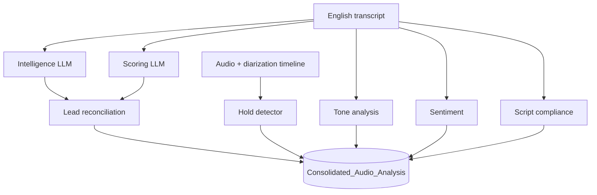

# Scoring · Intelligence · Hold Time — Engineering Roadmap

**Last updated:** 2026-07-06  
**Goal:** World-class, consistent call analysis — scoring, lead generation, hold capture, tone, sentiment, script compliance.

---

## Problem statement (2026-07)

| Symptom | Example | Root cause |
|---------|---------|------------|
| Scoring vs Intelligence mismatch | Scoring: **Warm Lead** · Intelligence: **No loan discussed** | `Lead_Classification` from scoring LLM runs **before** intelligence; no reconciliation |
| False loan leads | Credit card **rewards** call tagged as lead | LLM treats "credit" as loan signal |
| Hold time missing | Agent puts customer on hold — not captured | Feature not built yet |

---

## Architecture (target)



**Single source of truth for loan leads:** Intelligence `Loan_Is_Loan_Call` drives `Lead_Classification` after both passes complete.

---

## Phase 1 — Lead consistency *(in progress)*

### 1.1 Reconcile Lead_Classification with intelligence ✅ code

- After `extract_intelligence()`, run `reconcile_lead_classification(scores)`
- If `Loan_Is_Loan_Call == No` → `Lead_Classification = Not a Lead`
- If `Yes` → derive Hot / Warm / Cold from `Loan_Interest` + `Loan_Success_Probability`

### 1.2 Tighten scoring prompt ✅ code

- Explicit rules: credit card rewards, balance enquiry, PIN ≠ loan lead
- Loan lead only for home/personal/car/business loan, EMI, disbursement, apply

### 1.3 Tests ✅ code

- Unit tests: rewards call → Not a Lead; genuine loan → Hot/Warm/Cold

### 1.4 Dev verify

- Re-process sample credit-card rewards call
- Scoring tab + Intelligence tab must agree on loan lead

**Deploy:** `sp-ai-stack.tar` only (controller). No frontend change required for Phase 1.

---

## Phase 2 — Hold time capture *(planned)*

### 2.1 Detection (hybrid)

| Signal | Method |
|--------|--------|
| Transcript | Agent phrases: "please hold", "hold the line", "one moment", "wait kariye" |
| Audio timeline | Long gaps / hold music on mixed or agent channel after hold phrase |
| Diarization | Customer silent segments while agent away (> N sec) |

### 2.2 Data model

New columns on `Consolidated_Audio_Analysis`:

| Column | Type | Description |
|--------|------|-------------|
| `AI_Hold_Events` | NVARCHAR(MAX) JSON | `[{start_sec, end_sec, duration_sec}]` |
| `AI_Hold_Total_Sec` | FLOAT | Total hold seconds |
| `AI_Hold_Count` | INT | Number of hold episodes |

### 2.3 UI

- **Call Intelligence tab:** Hold summary (count, total mm:ss, longest hold)
- **Reports:** KPI block + filterable table column; aggregate avg hold per agent/location/date range

### 2.4 Pipeline

- New `hold_worker.py` in ai-mvp (runs after diarization, before/at scoring)
- Persist via `upsert_scoring_result` / backend callback

**Deploy:** migration SQL + `sp-ai-stack.tar` + `sp-frontend.tar` + `sp-backend.tar`

---

## Phase 3 — Quality verification *(tone · sentiment · script)*

### 3.1 Current pipeline

| Feature | Worker | When | Fallback |
|---------|--------|------|----------|
| Sentiment | `sentiment_worker` / enrichment | After scoring | Keyword ensemble |
| Tone | `tone_worker` (emotion2vec) | After scoring | Librosa / transcript |
| Script compliance | `script_worker` | After scoring | Keyword checklist |

### 3.2 Verification checklist (dev)

- [ ] Run `ai-mvp/test_improvements.py` — all pass
- [ ] Sample call: agent polite → sentiment Agent polarity > 0
- [ ] Sample call: tone tab shows Agent/Customer overall tone
- [ ] Sample call: script compliance > 50% on good opening/closing transcript
- [ ] Prod logs: `enrichment Done sentiment=… script=…%`

### 3.3 Hardening (if gaps found)

- Align script compliance weights with bank protocol checklist
- Sentiment: skip filler-only lines; per-utterance cap
- Tone: verify emotion2vec model loaded (`TONE_BACKEND=emotion2vec`)

---

## Phase 4 — Reports & lead dashboard

- Loan lead KPI aligned with reconciled `Lead_Classification`
- Filter: Hot / Warm / Cold / Not a Lead
- Cross-check with Intelligence loan block
- Hold time KPIs (after Phase 2)

---

## Execution order (you + agent)

```
1. Phase 1 lead fix        ← NOW (dev test → sp-ai-stack.tar)
2. Phase 3 verification    ← run test suite + one prod sample re-process
3. Phase 2 hold time       ← next sprint (DB + worker + UI + reports)
4. Phase 4 report polish   ← after 2+3 stable
```

---

## Prod deploy gate (mandatory)

Only after dev verification passes:

1. `npm test` / `python ai-mvp/test_improvements.py` / lead reconciliation tests
2. Re-process 1 known rewards call + 1 known loan call — tabs agree
3. Build `sp-ai-stack.tar` (and frontend/backend if UI/API changed)
4. Copy tars + SQL migrations + deploy script
5. Prod: load → `deploy-diarization-hotfix.sh` or AI stack hotfix script
6. Hard refresh UI; confirm one call end-to-end

---

## Success metrics

- **Lead accuracy:** Scoring `Lead_Classification` matches Intelligence loan block on 10 sample calls
- **Zero false warm lead** on credit-card-rewards-only calls
- **Hold (Phase 2):** Hold episodes detected within ±15s of manual listen on 5 samples
- **Tone/Sentiment/Script:** test_improvements.py green; enrichment logs on every scored call
